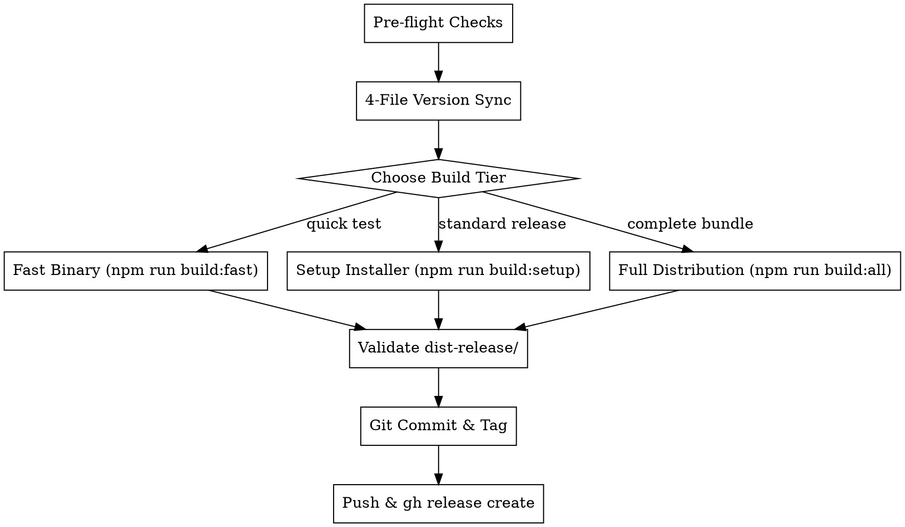

# GitHub Deployment for Desktop Applications

## Overview
Standardized, reliable procedure for deploying desktop application releases to GitHub. Enforces strict version synchronization across project manifests, utilizes speed-optimized build pipelines, validates staged binaries, and publishes releases with automated changelogs.

## When to Use
- Deploying a new version to GitHub
- Creating Git release tags (`vX.Y.Z`) and pushing upstream
- Publishing GitHub Releases with executable and installer attachments (`dist-release/`)
- Verifying version synchronization across package and build descriptors

### When NOT to Use
- Local daily development or UI-only testing (use `npm run dev` or `npm run check`)
- Running WSL-internal integration tests (`cargo test --lib -- --ignored wsl_it`)

---

## The 4-File Version Synchronization Rule

Before triggering any release build or creating a Git tag, verify and bump the version string across all 4 configuration files:

| File | Key / Location | Example |
|---|---|---|
| `package.json` | `"version"` | `"1.2.3"` |
| `package-lock.json` | Root `"version"` and `packages[""].version` | `"1.2.3"` |
| `src-tauri/Cargo.toml` | `[package] version` | `"1.2.3"` |
| `src-tauri/tauri.conf.json` | `"version"` | `"1.2.3"` |

> [!CAUTION]
> Never bump one file without updating the other three. Inconsistent versions cause installer metadata corruption and mismatched release assets.

---

## Deployment Workflow



### 1. Pre-flight Verification
Run type checking and Rust unit tests:
```bash
npm run check
cd src-tauri && cargo test
```
Confirm all checks pass before proceeding.

### 2. Build Execution
Select the appropriate build tier for the release:

- **Standard Release (Recommended, ~35–45s)**:
  ```bash
  npm run build:setup
  ```
  Generates `dist-release/LocalLLMPanel-v<version>.exe` and `dist-release/Local.LLM.Panel_<version>_x64-setup.exe`.

- **Fast Verification (~15–25s)**:
  ```bash
  npm run build:fast
  ```
  Generates standalone portable executable without installer packaging overhead.

- **Full Distribution Bundle (~2–3m)**:
  ```bash
  npm run build:all
  ```
  Generates Standalone + NSIS setup + WiX MSI package.

### 3. Validate Staged Artifacts
Inspect `dist-release/` to verify files are present, non-empty, and correctly version-stamped:
```powershell
Get-ChildItem dist-release
```
Expected files for version `1.2.3`:
- `LocalLLMPanel-v1.2.3.exe` (approx 30–35 MB)
- `Local.LLM.Panel_1.2.3_x64-setup.exe` (approx 4–6 MB)

### 4. Git Commit and Tagging
Stage the modified manifests, lockfiles, and release artifacts:
```bash
git add package.json package-lock.json src-tauri/Cargo.toml src-tauri/tauri.conf.json src-tauri/Cargo.lock dist-release/
git commit -m "release: v<version>"
git tag -a "v<version>" -m "Release v<version>"
```

### 5. Push and Publish Release to GitHub
Push branch and tags to remote:
```bash
git push origin main
git push origin "v<version>"
```

Create the GitHub Release with attached assets using GitHub CLI:
```bash
gh release create "v<version>" \
  dist-release/LocalLLMPanel-v<version>.exe \
  dist-release/Local.LLM.Panel_<version>_x64-setup.exe \
  --title "Local LLM Panel v<version>" \
  --generate-notes
```

*If `gh` CLI is not authenticated or unavailable, upload the binaries from `dist-release/` via the GitHub Web UI at `https://github.com/SeanDolan0/LocalLLmPanel/releases/new`.*

---

## Common Mistakes & Red Flags

| Mistake | Prevention |
|---|---|
| Bumping `package.json` but forgetting `Cargo.toml` | The build runner script (`scripts/build.mjs`) automatically warns on mismatch. Check and fix immediately. |
| Running raw `tauri build` instead of `npm run build:setup` | Raw `tauri build` might not set LLVM in `PATH` or will run slow default configurations. Always use the npm runner scripts. |
| Forgetting to push Git tags | Always run `git push origin v<version>` in addition to `git push origin main`. |
| Pushing without running `npm run check` | Preflight takes < 4 seconds. Never skip preflight checks. |
